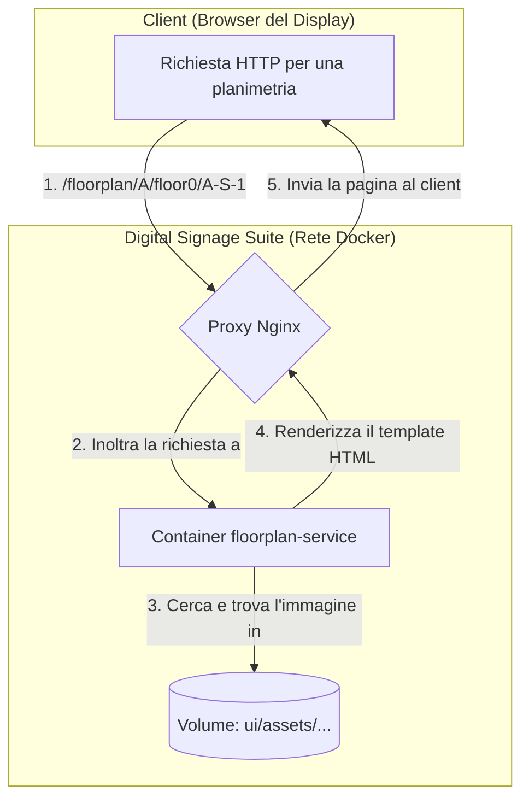

# Floor Plan Service (Servizio Planimetrie)

[](https://shields.io/)
[](https://www.python.org/)
[](https://flask.palletsprojects.com/)
[](https://opensource.org/licenses/MIT)

Un microservizio visuale che mostra planimetrie di edifici e piani specifici, progettato per essere visualizzato su display dedicati.


---

## Indice

- [Panoramica del Progetto](#panoramica-del-progetto)
- [Diagramma dell'Architettura](#diagramma-dellarchitettura)
- [Caratteristiche Principali](#caratteristiche-principali)
- [Tecnologie Utilizzate](#tecnologie-utilizzate)
- [Struttura della Directory](#struttura-della-directory)
- [Struttura delle Immagini](#struttura-delle-immagini-importante)
- [Prerequisiti](#prerequisiti)
- [Guida all'Installazione](#guida-allinstallazione)
- [Accesso e Link Utili](#accesso-e-link-utili)
- [Variabili d'Ambiente](#variabili-dambiente)
- [Esecuzione dei Test](#esecuzione-dei-test)
- [Come Contribuire](#come-contribuire)
- [Licenza](#licenza)

---

## Panoramica del Progetto

Il `floorplan-service` fornisce un contesto visuale all'interno della Digital Signage Suite. Il suo scopo è mostrare una specifica immagine (planimetria, mappa, indicazione) a schermo intero, determinata dinamicamente dai parametri passati nell'URL. Questo permette di avere display dedicati a mostrare mappe di piani o percorsi specifici.

---

## Diagramma dell'Architettura

L'architettura di questo servizio è più semplice rispetto agli altri, poiché non interagisce con API esterne ma serve file locali in modo intelligente.


1.  Un display richiede un URL specifico al **Proxy Nginx**.
2.  Nginx inoltra la richiesta al **`floorplan-service`**.
3.  Il servizio Flask cerca l'immagine richiesta nel volume locale dove sono salvate le planimetrie.
4.  Flask renderizza la pagina HTML, inserendo l'URL dell'immagine trovata come sfondo.
5.  La pagina completa viene restituita al display.

---

## Caratteristiche Principali

- ✅ **Visualizzazione Dinamica**: Mostra un'immagine diversa in base ai parametri `edificio`, `piano` e `nome_immagine` nell'URL.
- ⚙️ **Configurazione Flessibile**: La mappatura tra sigle degli edifici e nomi delle cartelle è gestita da variabili d'ambiente.
- 🛡️ **Sicurezza**: Include estensioni come `Talisman` e `CORS` e una Content Security Policy configurata.
- ❤️ **Health Check**: Endpoint `/health` per un facile monitoraggio dello stato del servizio.
- 📄 **Pagina di Errore Personalizzata**: Mostra una pagina 404 coerente con la grafica del sistema.
- 🐳 **Containerizzato**: Completamente gestito tramite Docker e Docker Compose.

---

## Tecnologie Utilizzate

- **Backend**: Python 3.11, Flask, Gunicorn
- **Containerizzazione**: Docker, Docker Compose
- **Sicurezza**: Flask-Talisman, Flask-Cors
- **Configurazione**: Python-dotenv

---

## Struttura della Directory
```
floorplan-service/
├── app/
│   ├── __init__.py       # Application factory (crea l'app Flask)
│   ├── config.py         # Carica e processa la configurazione da .env
│   └── routes.py         # Definisce tutte le rotte e la logica
│
├── ui/
│   ├── assets/           # Immagini delle planimetrie e assets comuni
│   ├── static/           # File CSS e JavaScript
│   ├── 404.html
│   └── index.html
│
├── .env.example
├── Dockerfile
├── requirements.txt
└── run.py
```

---

## Struttura delle Immagini (Importante!)

Perché il servizio funzioni, le immagini devono essere organizzate in una struttura specifica all'interno di `ui/assets/`.

```
ui/
└── assets/
    ├── building_A/
    │   ├── floor0/
    │   │   └── A-S-6.png
    │   └── floor_1/
    │       └── A-1-6.jpg
    │
    ├── building_B/
    │   └── ...
```

---

## Prerequisiti

- [Docker Engine](https://docs.docker.com/engine/install/)
- [Docker Compose V2](https://docs.docker.com/compose/install/)

---

## Guida all'Installazione

1.  **Clona il Repository**.
2.  **Configura le Variabili d'Ambiente**: In `floorplan-service`, copia `.env.example` in `.env`.
3.  **Prepara la Struttura delle Immagini**: Crea le cartelle in `ui/assets/` e inserisci le immagini.
4.  **Avvia lo Stack Docker**: Dalla cartella principale, esegui `docker compose up --build -d`.

---

## Accesso e Link Utili 🔗

- **Link Planimetrie**: `http://<IP_SERVER>/floorplan/{EDIFICIO}/{PIANO}/{IMMAGINE}`
  - **Esempio:** `http://localhost/floorplan/A/floor_1/A-1-6`

- **Health Check**: `http://localhost/floorplan/health`

---

## Variabili d'Ambiente

- `BUILDINGS`: Lista di sigle di edifici e nomi di cartelle (es. `A:building_A,B:building_B`).
- `ALLOWED_FLOORS`: Lista di numeri di piano permessi (es. `-1,0,1,2,3`).

---

## Esecuzione dei Test

La suite di test per questo servizio non è ancora stata implementata.

---

## Come Contribuire

Segui la procedura standard di Fork & Pull Request.

---

## Licenza

Questo progetto è rilasciato sotto la Licenza MIT.